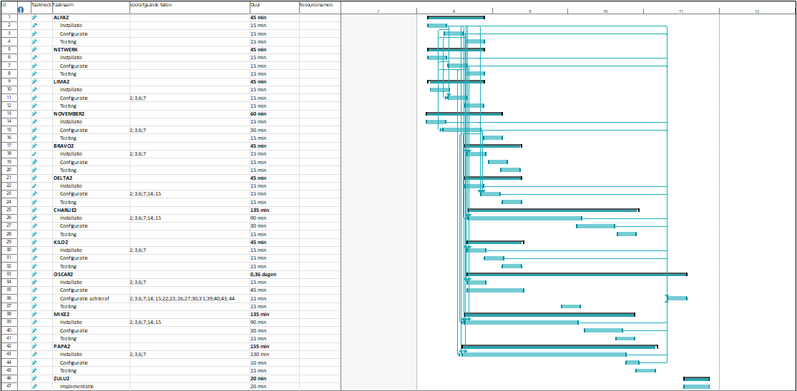

# Plan van Aanpak

## Taakverdeling

| Servernaam   	| Taak            	| Tijdsduur 	| Personen                	|
|--------------	|-----------------	|-----------	|-------------------------	|
| ALFA2        	| DC              	| 45 min    	| Jens DF, Bert en Edward 	| 
| BRAVO2       	| DC              	| 45 min    	| Aron, Jeroen en Michiel 	|   
| CHARLIE2     	| Exchange        	| 135 min   	| Cedric en Kwinten       	| 
| DELTA2       	| Webserver       	| 45 min    	| Cedric en Kwinten       	|   
| KILO2        	| DHCP            	| 45 min    	| Enzo, Juan en Matthias  	|     
| LIMA2        	| Fileserver      	| 45 min    	| Steven en Emiel         	|       
| MIKE2        	| Sharepoint      	| 135 min   	| Edward en Jens P        	|       
| NOVEMBER2    	| SQL             	| 60 min    	| Aron, Jeroen en Michiel 	|         	
| OSCAR2       	| PRTG Monitoring 	| 90 min    	| Emiel, Enzo, Matthias   	|       
| PAPA2        	| SCCM            	| 155 min   	| Thor, Sam, Steven       	|
| WORKSTATIONS 	|                 	|           	|                         	|         
| ZULU2        	| Firewall        	| 20 min        | Emiel, Juan               |         
| Network      	|                 	| 45 min    	| Tristan en Tommy        	|  

## Servers

* Indien mogelijk lokaal installeren voor performance issues te vermijden.
* Indien mogelijk gebruik maken van scripts maar is geen verplichting. 
* Van zodra een team zijn server online is, kijken zij in testing voor een volgende server te testen en een testrapport te schrijven. 

## Beschikbare ESXI servers

* 172.22.2.3 (BRAVO2 & NOVEMBER2)
* 172.22.2.4 (ALFA2)
* Lokale PCs

## Benodigdheden

* Connecteer uw kabel met de VLAN300 switch of VLAN500 switch (zie post-it's op de switch)
	* Poort 6 - ...
* Stel in de virtuele machine ook de juist VLAN in als netwerkadapter. 	

	
### NETWORK
* SWITCHES: Switch 1.1 (Switch6) , 1.2 (Switch5) , 1.3 (Switch4)
* ROUTERS: Router 1.1 (Router1), Router 1.2 (Router3), Router4 (1.3/4.3)

## Tijdsschema

