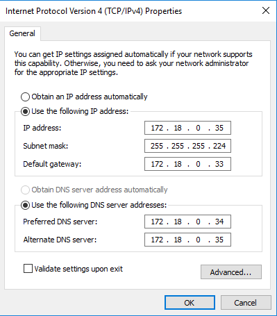
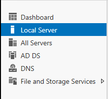
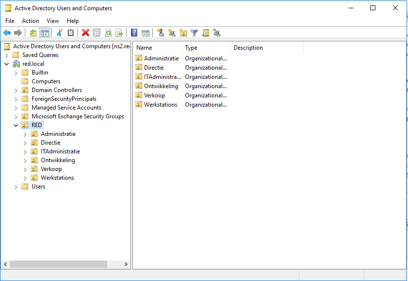
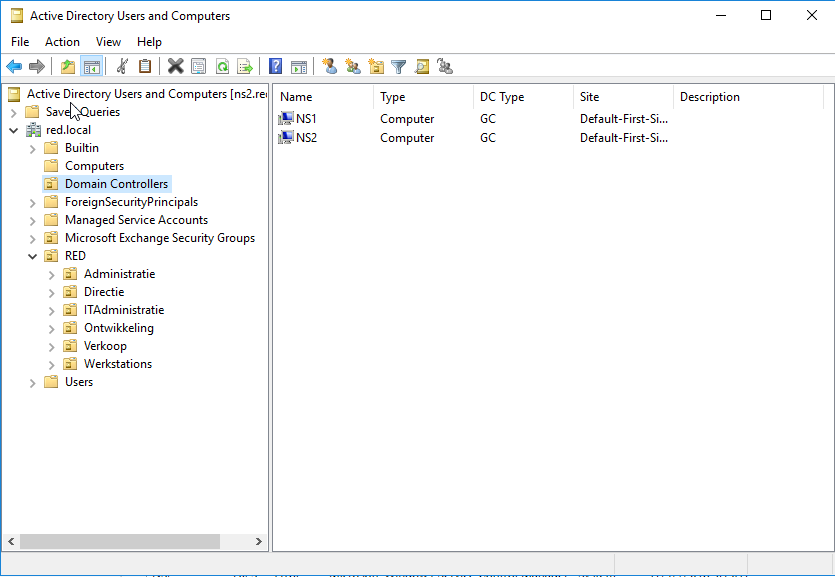
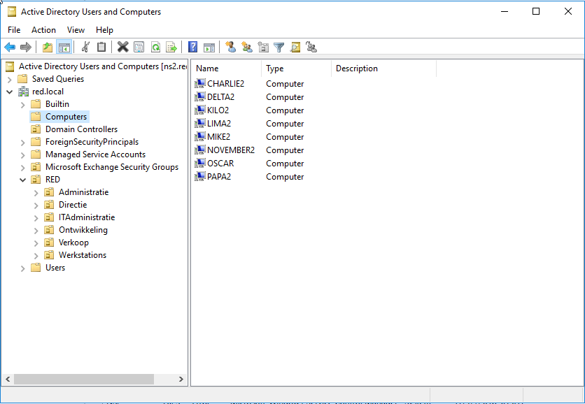

# Testrapport taak ...

Auteur(s) testrapport: Mathias Meyfroidt

# Precondities

 * Alfa is correct opgesteld
 * Ingelogd op bravo als domain admin

# Testing

### Servernaam en domein

 * Controle naam en domein in Server Manager > local server
   1. Computer name: ns2
   2. Domain name: red.local
   
### Netwerksettings
 * IpV4 settings van netwerk adapter gecontroleerd
   1. IP is 172.18.0.35 
   2. SM is 255.255.255.224 
   3. Default gateway is 172.18.0.33 
   4. Preferred en alternate dns is ingesteld op ns1 en ns2
   
    
   
 ### Roles
  * AD DS en DNS roles staan in server manager

     
  
 ### Duplicatie Alfa2
  * Duplicatie OU
    1. red.local is aanwezig
    2. Alle sub OU's zijn aanwezig

     

  * Duplicatie Domain Controllers
    1. Beide entries zijn aanwezig

     

  * Duplicatie Servers
    1. Alle servers zijn aanwezig bij Computers

     

