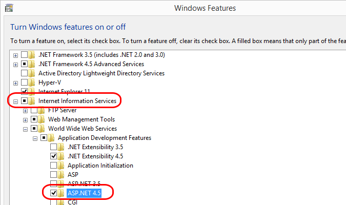
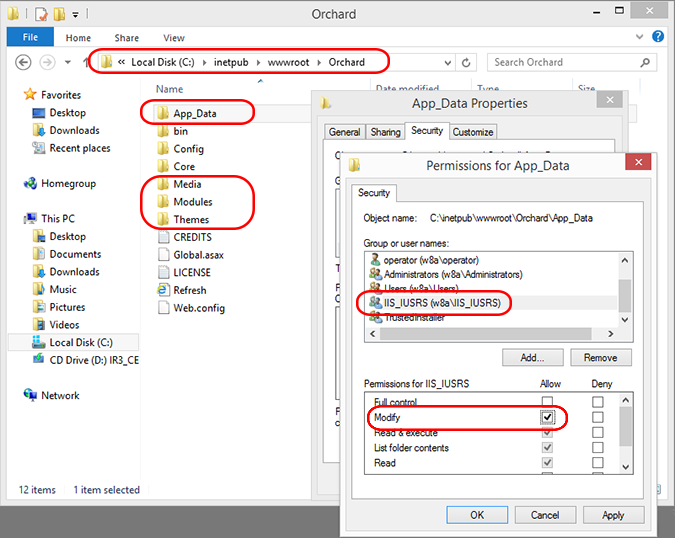
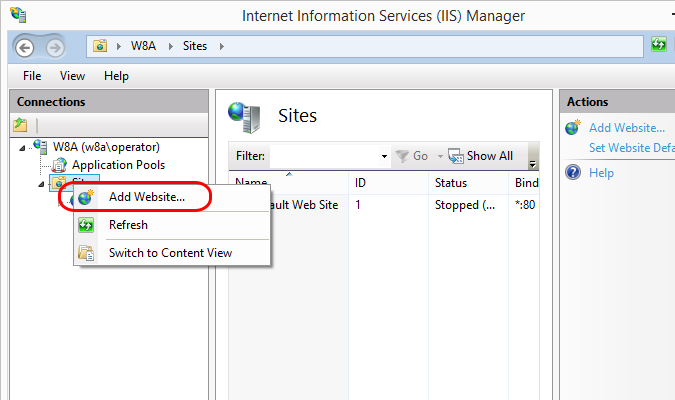
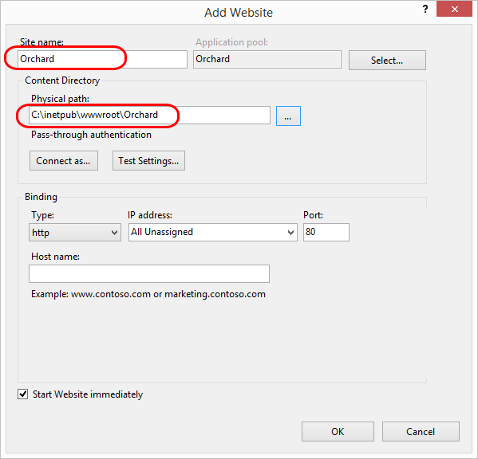
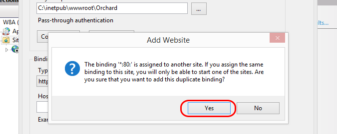

# Documentatie Delta2

Auteur documentatie: Kwinten Braet

De bedoeling van dit document is het opzetten van een IIS Webserver met ASP en een ASP Applicatie op een Windows Server 2016.

## Met scripts
De 3 scripts na elkaar uitvoeren. Het eerste script installeert IIS en de website. Deel 2 hernoemt de computer en deel 3 voegt  de server toe in het domein.

## Manueel

### Stap 1 Windows Installatie
Installeer een Windows Server 2016 met het officiële iso bestand. Geef de machine zeker 50gb opslagruimte en 1GB ram! Zo krijg je geen fouten bij de installatie. Installeer ook Quest Additions en zet de Netwerkinterface op Bridged.

### Stap 2 WebServer installatie
Eens Windows Server geinstalleerd is starten we met de installatie van de Webserver.
- Ga naar de Server Manager applicatie. Mogelijks start deze automatisch bij het opstarten van de machine.
- Bovenaan klik je op "Add roles and features".
- In de lijst van beschikbare roles klikt men op "Web server (IIS)".
- Windows geeft meldingen dat er extra features moeten geinstalleerd worden wat je dan ook moet aanvaarden.
- Je klikt hele tijd op Next tot je op de Install knop kan klikken.
- De installatie wordt gedaan en de server zal nadien moeten herstarten.
- Eens de machine opnieuw online is kan je de webserver configureren.

### Stap 3 HTTPS Installatie
 - Je opent opnieuw de "Server Manager" applicatie.
 - Klik rechtsboven op "Tools" en klik in de lijst op "Internet Information Services (IIS) Manager". Een nieuwe applicatie opent.
 - Klik op je "WIN-..." machine.
 - In het midden heb je allemaal icoontjes. Klik op "Server Certificates".
 - Klik rechts op "Create Self-Signed Certificate".
 - Bij Friendly name vul je Team Red in.
 - Klik links op "Sites" en daarna op "Default Web Site".
 - Klik rechts op "Bindings". Een nieuw venster opent.
 - Klik op "Add". Een nieuw venster opent.
 - Selecteer bij "Type" "https". Ip address zet je op op "All Unassigned". "Port:" moet 443 zijn en bij "SSl Certificate" selecteer je "Team Red".
 - Klik op "OK".
 - HTTPS is nu geinstalleerd maar je krijgt nog certifcaat problemen als je de website wilt bezoeken.
 - Om dit op te lossen typ je in het startmenu "Run" en je opent deze applicatie.
 - Een nieuw venster opent. Daarin typ je "mmc" en drukt op enter of klik "OK". Een nieuwe applicatie opent.
 - Klik Rechtsboven op "File" en selecteer in de lijst "Add/Remove Snap-in". Een nieuw venster opent.
 - DubbelKlik in de lijst op "Certificates". Een nieuw venster opent.
 - Selecteer "computer account" en klik "Next".
 - Selecteer "Local Computer" en klik op "Finish".
 - Klik links op "Certificates Local Computer", klik op "Personal" en klik op "Certificates".
 - Rechtsklik op het red.local certificaat en Klik op "Copy".
 - Klik in de lijst links op "Trusted Root Certificates", daarna op "Certificates".
 - In de lijst rechts rechts-klik je en selecteer je "Paste".
 - Je website is nu volledig bereikbaar zonder certificaatproblemen!

### Stap 4 ASP Installatie + Applicatie
Eens Windows Server geinstalleerd is starten we met de installatie van de Webserver.
- Ga naar de Server Manager applicatie. Mogelijks start deze automatisch bij het opstarten van de machine.
- Bovenaan klik je op "Add roles and features".
- In de lijst van beschikbare roles klikt men op "Web server (IIS)". Daarna op "web Server" en daarna op "Application Development en duid alle onderliggende Roles aan om ASP te installeren!
- Installeer deze roles!

### Installatie App Orchard
- Download de laatste versie van Orchard via https://github.com/OrchardCMS/Orchard/releases . Download de "Orchard.Web.XXX.zip .
- Kopieer de map "Orchard" (Waar je onder andere App_Data in vindt) naar C:\inetpub\wwwroot\.
- In de Map Orchard zijn er 3 mappen waarvan je de rechten moet wijzigen: Modules, Theme en Media. De rechten van IIS_USERS moet verandert worden zodat ook "Modify" is toegelaten. Rechtsklik Poperties, Security, Edit.

- Stop de "Default Website"
- Maak een nieuwe Website met de naam Orchard en zorg dat het fysieke pad naar de Orchard map klopt.

- Nu kan je browsen naar localhost/install om de installatie van Orchard te starten!
- Vul een naam van de site, username en wachtwoord in.
- Bij "How would you like to store your data" kies je voor "Use an existing SQL Server".
- Bij Connection String vul je "   Data Source=172.18.0.5;Initial Catalog=Website;Persist Security Info=True;User ID=Website;Password=Admin2018;   "
- Klik op Finish Setup en na eventjes wachten moet je website geinstalleerd zijn!
