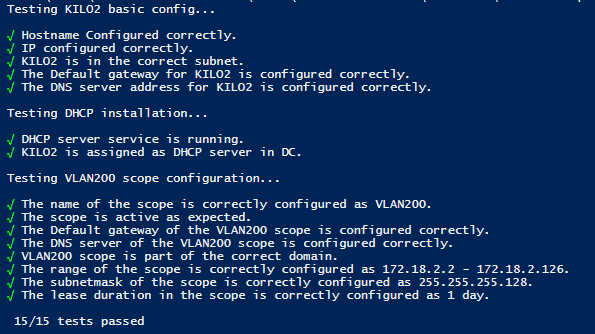

# Testplan taak: kilo2

Auteur(s) testplan: Enzo De Weirt, Mathias Meyfroidt

## Inhoud
Testplan van installatie en integratie van DHCP-server KILO2 binnen het domain red.local

### Testen aan de hand van testscipt

 1. Voer het script `Kilo2Tests.ps1` uit.
 
 2. Ga na of de testen slagen en troubleshoot waar nodig aan de hand van de error messages. 
        

### Manueel testen van configuratie

1. Open powershell

2. Controlleer of de netwerk adapter correct geconfigureerd werd aan de hand van `Ipconfig /all`.
   - IP-adres: 172.18.0.2
   - Subnet mask: 255.255.255.224
   - Default-gateway: 172.18.0.1
   - Dns-server: 172.18.0.34
   
3. Ga na of de naam correct werd aangepast naar kilo2 met het Commando `Hostname`.

4. Controlleer of DHCP correct geinstalleerd is aan de hand van `Get-Service -Name *dhcp*`
   - De service DhcpServer zou zichtbaar moeten zijn met status: Running.  

5. Ga na of de server toegevoegd is aan de domaincontroller met `Get-DhcpServerInDC` en `Get-DhcpServerSetting` in de output zie je respectievelijk dat:
   - Het huidige toestel weergegeven wordt als DHCP-server.
   - *IsDomainJoined* als true staat.

6. Ga na of de dns server en default gateway correct zijn ingesteld voor Vlan 200 met het commando `Get-DhcpServerV4OptionValue -ScopeId 172.18.2.0` 
   - Het IP-adres van de default gateway is 172.18.2.1
   - De IP-adressen van de DNS-servers zijn 172.18.0.34 en 172.18.0.35
   - Het domain is red.local

7. Controlleer of de scope voor VLAN 200 correct is geconfigureerd aan de hand van `Get-DhcpServerV4Scope -ScopeId 172.18.2.0`. De output toont dat:
   - De scope een subnetmask heeft van 255.255.255.128.
   - De naam van de scope "VLAN200" is
   - De scope gaat van 172.18.2.2 tot 127.18.2.126
   - De scope een leasetime heeft van 1 dag
   - De scope is active

### Testen vanaf client 

8. Log in op een client binnen VLAN 200 en controlleer of die een IP-adres verkreeg uit de meegegeven range

