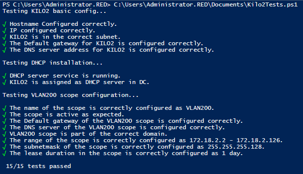

# Testrapport taak KILO2

Auteur(s) testrapport: Cedric De Witte

# Precondities

- De initiele installatie en configuratie is compleet
- De DHCP rol is geïnstalleerd
- Een DHCP pool is geconfigureerd voor VLAN200

# Testing

1. Run het script Kilo2Tests.ps1
   
2. In de output is te zien dat alle testen slagen

