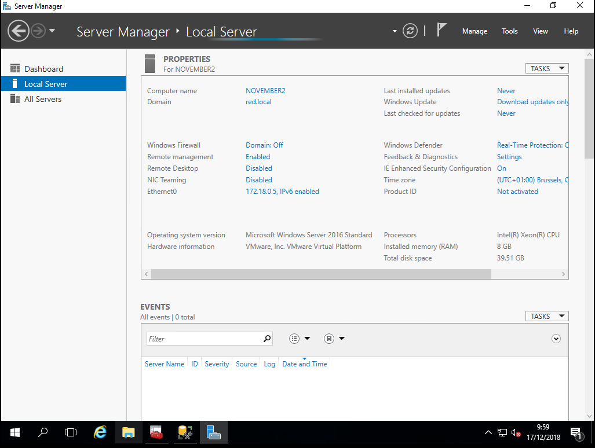
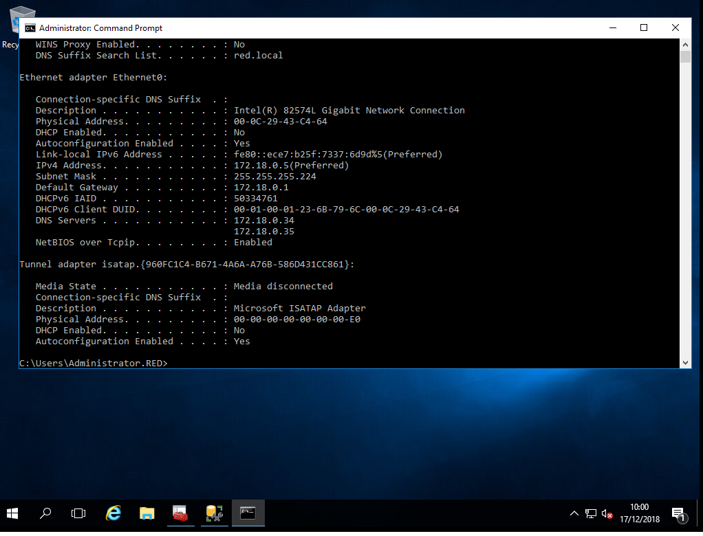
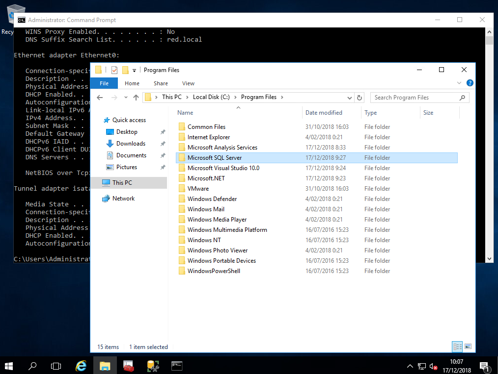
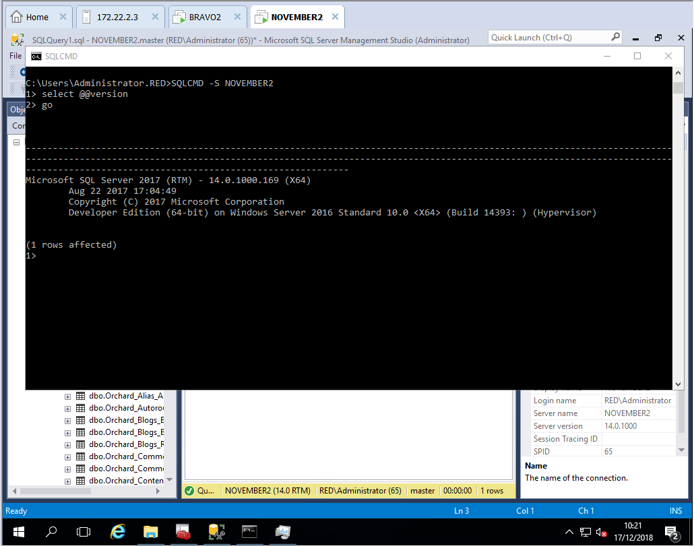
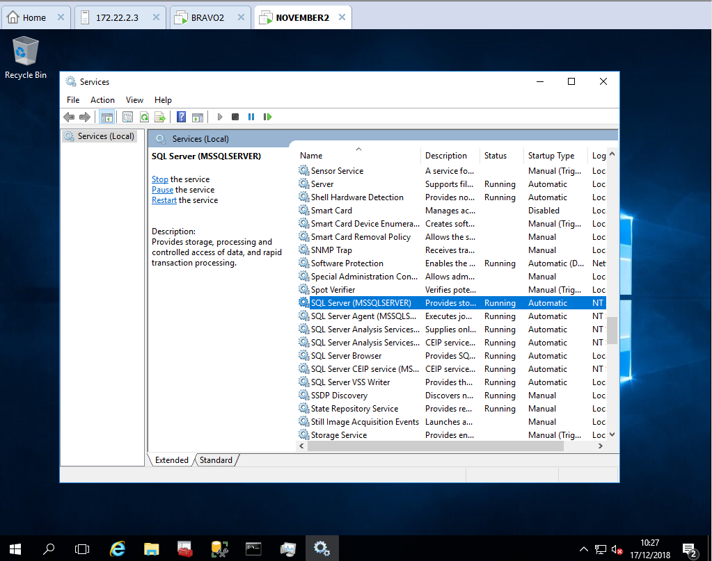
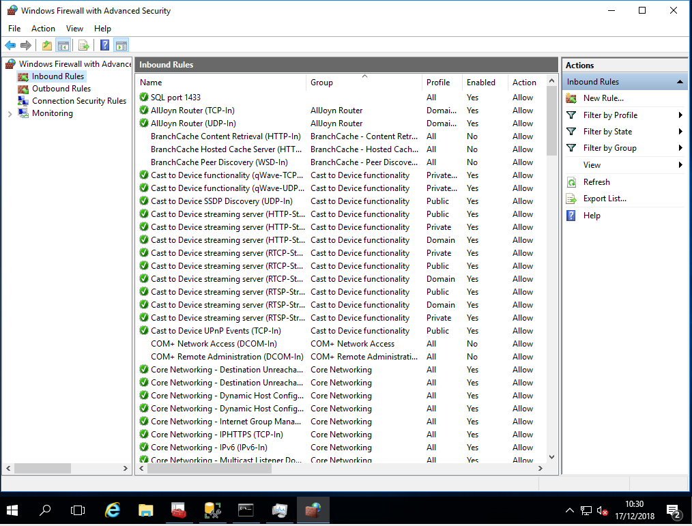

# Testrapport NOVEMBER2

Auteur(s) testrapport: Raman Michiel, Poelaert Jeroen

# Precondities
November2 is volledig geinstalleerd en geconfigureerd.

# Testing
## Naam server en domein
1. Computernaam: NOVEMBER2
2. Domein: red.local

## Netwerksettings
1. IP-address: 172.18.0.5
2. Subnet mask: 255.255.255.224
3. Default gateway: 172.18.0.1
4. Preferred dns: 172.18.0.34
5. Alternate dns: 172.18.0.35

## Nakijken correcte SQL Server installatie
1. Folder is aanwezig in program files

2. Commando "SQLCMD -S November2"
3. "select @@version"
4. Commando "go"

## (Optioneel) Nakijken SQL Server instance name

## Testen Firewall
1. Controleer of de rule **SQL port 1433** staat.

- Delta2 is succesvol verbonden met November2 en de website werkt.
