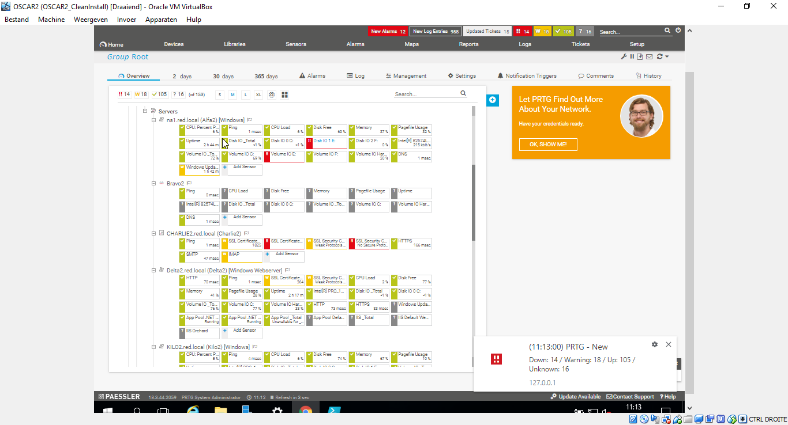
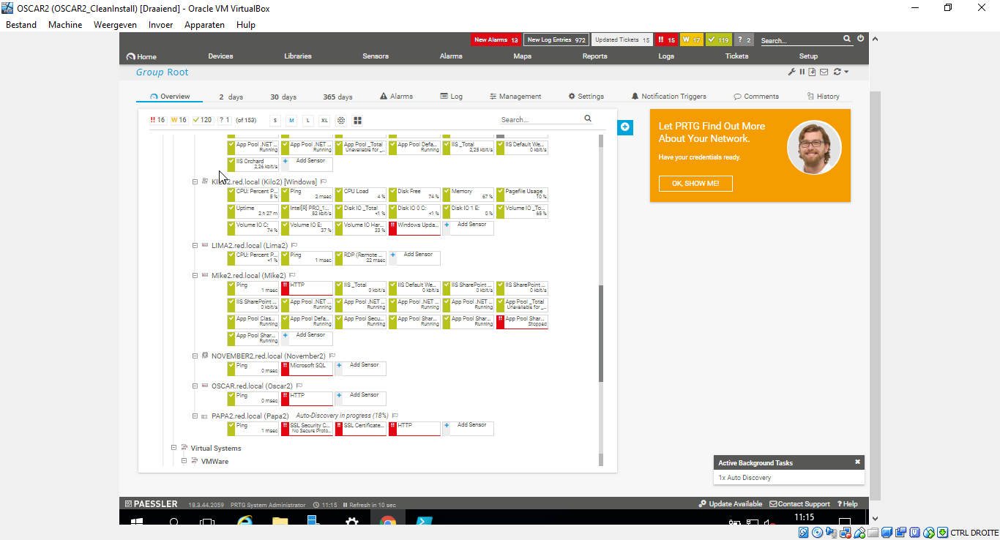

# Testrapport taak Oscar2

Auteur(s) testrapport: Mathias Meyfroidt

# Precondities

- De initiele installatie en configuratie van de server zijn compleet
- PRTG is geïnstalleerd
- De servers en bijhorende sensoren zijn toegevoegd in PRTG

# Testing

1. Open de PRTG-monitoring tool door in de browser te navigeren naar 127.0.0.1 en login met username prtgadmin en paswoord prtgadmin

2. Ga naar overview

3. Alle servers zijn toegevoegd

4. Alle sensoren zijn via autodiscovery toegewezen aan de juiste server.

  

