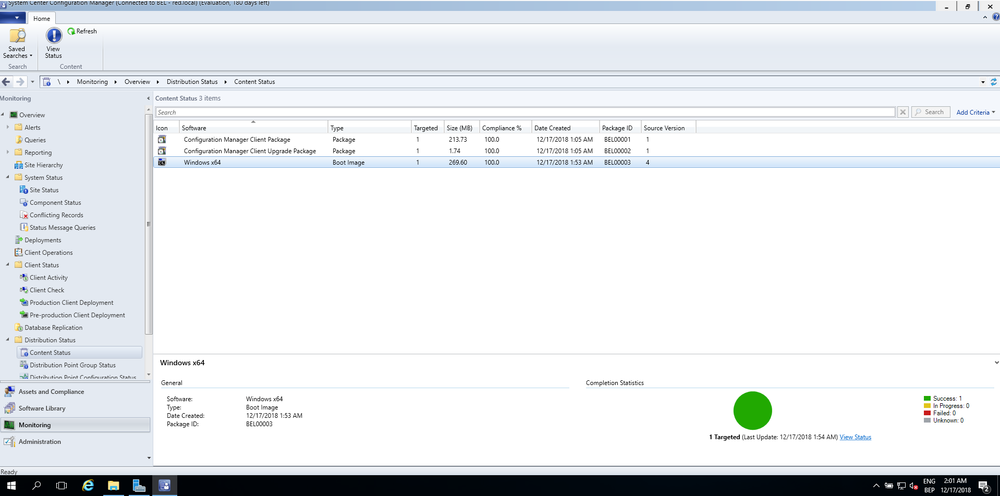

# Testrapport PAPA2

Auteur(s) testrapport: Steven Anno

# Precondities

PAPA2 is geïnstalleerd en geconfigureerd.

# Testing

## Een geslaagde installatie op de C:\ schijf

## Een geslaagde SCCM

## Een geslaagde configuratie van SCCM

 

