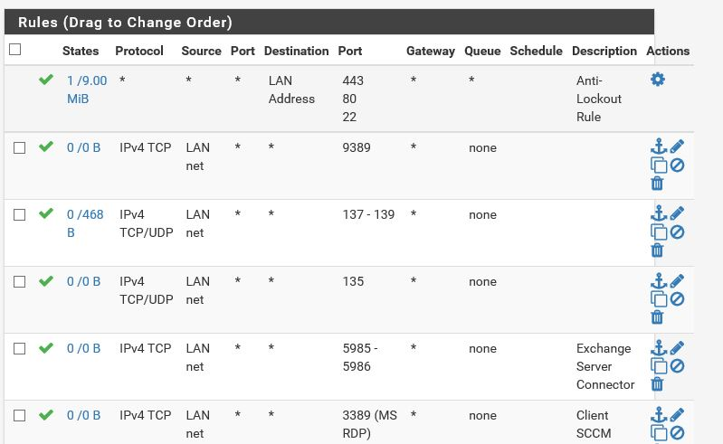
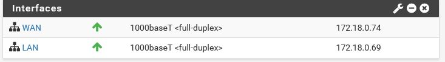
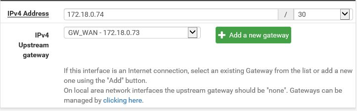
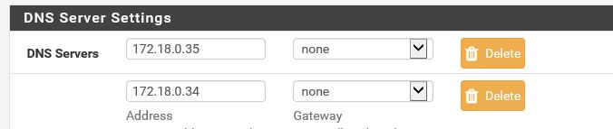
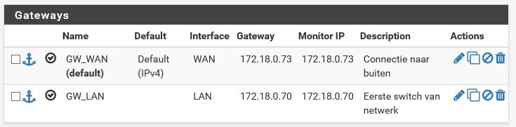
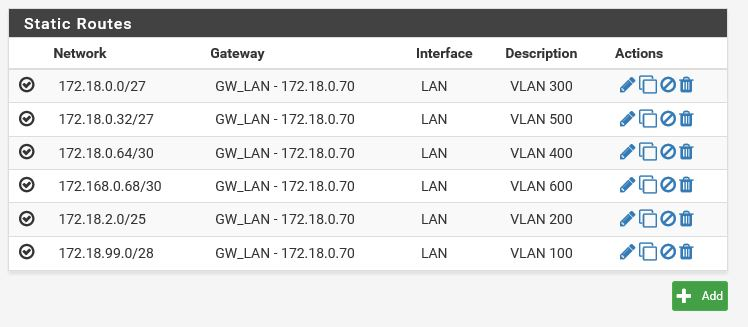

# Testrapport taak ZULU2

Auteur(s) testrapport: Thor & Emiel

# Precondities

ZULU2 is geïnstalleerd en geconfigureerd via de .xml file. 
Client pc is geïnstalleerd heeft toegang tot de firewall via het adres 172.18.0.69

# Testen

1 & 2. We loggen in op de webGUI met username en password uit testplan.

Inloggen is geslaagd

3) We controleren dat de hostnaam is ingesteld.

4) We controleren dat er pass rules zijn.

5) We kijken dat de interfaces juist zijn ingesteld.

6) WAN heeft een upstream adres.

7) DNS-forwarder en DNS-resolver zijn uitgeschakeld.

8) DNS-servers zijn juist ingesteld.

9) We kijken dat er static routes zijn geconfigureerd.

